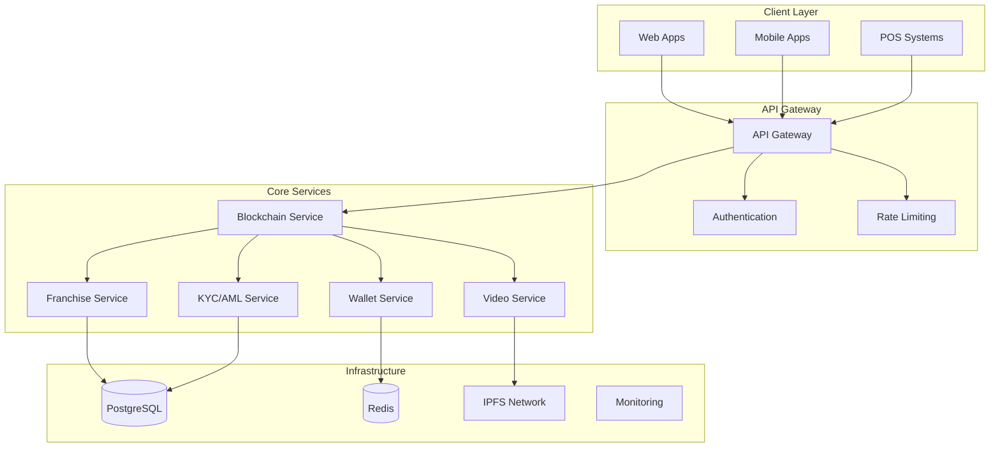

# 🏗 Архитектурная документация - The Hot Pot Spot

## Содержание
1. [Обзор архитектуры](#обзор-архитектуры)
2. [Микросервисная архитектура](#микросервисная-архитектура)
3. [Блокчейн архитектура](#блокчейн-архитектура)
4. [Архитектура данных](#архитектура-данных)
5. [API архитектура](#api-архитектура)
6. [Безопасность](#безопасность)
7. [Масштабирование](#масштабирование)
8. [Интеграции](#интеграции)

---

## 🎯 Обзор архитектуры

The Hot Pot Spot построен как **микросервисная система** с **блокчейн-ядром**, обеспечивающая высокую доступность, масштабируемость и безопасность.

### Архитектурные принципы
- **Domain-Driven Design**: Каждый сервис отвечает за свою предметную область
- **Event-Driven Architecture**: Асинхронная обработка событий
- **CQRS**: Разделение команд и запросов
- **Event Sourcing**: Хранение событий для аудита
- **API-First**: Все взаимодействие через API

### Высокоуровневая диаграмма



---

## 🔧 Микросервисная архитектура

### Сервисы системы

#### 1. API Gateway Service
**Ответственность**: Единая точка входа, маршрутизация, аутентификация

```rust
pub struct APIGateway {
    pub routes: HashMap<String, RouteHandler>,
    pub auth_service: AuthService,
    pub rate_limiter: RateLimiter,
}

impl APIGateway {
    pub async fn handle_request(&self, request: HttpRequest) -> HttpResponse {
        // Аутентификация
        let user = self.auth_service.authenticate(&request).await?;
        
        // Rate limiting
        self.rate_limiter.check_limit(&user.id).await?;
        
        // Маршрутизация
        let handler = self.routes.get(&request.path)?;
        handler.handle(request, user).await
    }
}
```

#### 2. Blockchain Core Service
**Ответственность**: Управление блокчейном, консенсус, транзакции

```rust
pub struct BlockchainService {
    pub consensus: ConsensusEngine,
    pub network: P2PNetwork,
    pub storage: BlockchainStorage,
}

impl BlockchainService {
    pub async fn process_transaction(&self, tx: Transaction) -> Result<Block, BlockchainError> {
        // Валидация транзакции
        self.validate_transaction(&tx).await?;
        
        // Добавление в мемпул
        self.mempool.add_transaction(tx).await;
        
        // Майнинг блока
        let block = self.consensus.mine_block().await?;
        
        // Распространение в сети
        self.network.broadcast_block(&block).await;
        
        Ok(block)
    }
}
```

#### 3. Franchise Network Service
**Ответственность**: Управление сетью франшиз, нодами, токеномикой

```rust
pub struct FranchiseService {
    pub network: FranchiseNetwork,
    pub tokenomics: TokenomicsEngine,
    pub pos_integration: POSIntegration,
}

impl FranchiseService {
    pub async fn register_franchise(&self, franchise_data: FranchiseData) -> Result<u64, ServiceError> {
        // Создание ноды
        let node_id = self.network.register_node(franchise_data).await?;
        
        // Настройка токеномики
        self.tokenomics.configure_node(node_id, &franchise_data.tokenomics).await?;
        
        // Интеграция с POS
        self.pos_integration.setup_franchise(node_id).await?;
        
        Ok(node_id)
    }
}
```

#### 4. Video Surveillance Service
**Ответственность**: Видеонаблюдение, стриминг, анонимизация

```rust
pub struct VideoService {
    pub surveillance: VideoSurveillanceSystem,
    pub streaming: StreamingManager,
    pub anonymization: AnonymizationEngine,
}

impl VideoService {
    pub async fn start_recording(&self, request: RecordingRequest) -> Result<String, VideoError> {
        // Проверка согласия
        self.surveillance.check_consent(&request.customer_id).await?;
        
        // Настройка анонимизации
        let anonymization_config = self.anonymization.configure(&request.preferences).await?;
        
        // Запуск записи
        let recording_id = self.surveillance.start_recording(&request, anonymization_config).await?;
        
        // Запуск стриминга (если требуется)
        if request.streaming_enabled {
            self.streaming.start_stream(recording_id, &request.platforms).await?;
        }
        
        Ok(recording_id)
    }
}
```

#### 5. KYC/AML Service
**Ответственность**: Верификация пользователей, соответствие требованиям

```rust
pub struct KYCService {
    pub verifier: DocumentVerifier,
    pub aml_engine: AMLEngine,
    pub compliance: ComplianceManager,
}

impl KYCService {
    pub async fn verify_user(&self, user_id: &str, documents: Vec<Document>) -> Result<KYCResult, KYCError> {
        // Верификация документов
        let verification_result = self.verifier.verify_documents(documents).await?;
        
        // AML проверки
        let aml_result = self.aml_engine.perform_checks(user_id).await?;
        
        // Обновление статуса
        let kyc_result = self.compliance.update_kyc_status(user_id, verification_result, aml_result).await?;
        
        Ok(kyc_result)
    }
}
```

#### 6. Wallet Service
**Ответственность**: Управление кошельками, HD деривация, транзакции

```rust
pub struct WalletService {
    pub hd_manager: HDWalletManager,
    pub transaction_processor: TransactionProcessor,
    pub security: WalletSecurity,
}

impl WalletService {
    pub async fn create_wallet(&self, user_id: &str, wallet_type: WalletType) -> Result<HDWallet, WalletError> {
        // Генерация HD кошелька
        let wallet = self.hd_manager.generate_wallet(user_id, wallet_type).await?;
        
        // Настройка безопасности
        self.security.setup_wallet_security(&wallet).await?;
        
        // Регистрация в системе
        self.register_wallet(&wallet).await?;
        
        Ok(wallet)
    }
}
```

---

## ⛓ Блокчейн архитектура

### Консенсус алгоритм: Proof of Stake + Reputation

```rust
pub struct ConsensusEngine {
    pub validators: ValidatorSet,
    pub reputation_system: ReputationSystem,
    pub stake_manager: StakeManager,
}

impl ConsensusEngine {
    pub async fn select_validators(&self, block_height: u64) -> Vec<Validator> {
        let mut candidates = Vec::new();
        
        for validator in &self.validators.active_validators {
            // Расчет репутационного score
            let reputation_score = self.reputation_system.calculate_score(validator.id).await;
            
            // Расчет stake score
            let stake_score = self.stake_manager.get_stake_ratio(validator.id).await;
            
            // Географическое распределение
            let geographic_score = self.calculate_geographic_score(validator).await;
            
            // Общий score
            let total_score = reputation_score * 0.4 + stake_score * 0.3 + geographic_score * 0.3;
            
            if total_score > MIN_VALIDATOR_SCORE {
                candidates.push(Validator {
                    id: validator.id,
                    score: total_score,
                    ..validator.clone()
                });
            }
        }
        
        // Сортировка и выбор топ валидаторов
        candidates.sort_by(|a, b| b.score.partial_cmp(&a.score).unwrap());
        candidates.truncate(MAX_VALIDATORS);
        
        candidates
    }
}
```

### P2P сеть

```rust
pub struct P2PNetwork {
    pub peers: HashMap<PeerId, Peer>,
    pub message_handler: MessageHandler,
    pub discovery: PeerDiscovery,
}

impl P2PNetwork {
    pub async fn broadcast_block(&self, block: &Block) -> Result<(), NetworkError> {
        let message = NetworkMessage::Block(block.clone());
        
        for (peer_id, peer) in &self.peers {
            if peer.is_connected() {
                peer.send_message(message.clone()).await?;
            }
        }
        
        Ok(())
    }
    
    pub async fn sync_blockchain(&self, peer_id: PeerId) -> Result<(), NetworkError> {
        let peer = self.peers.get(&peer_id).ok_or(NetworkError::PeerNotFound)?;
        
        // Получение последнего блока
        let last_block = self.get_last_block().await?;
        
        // Запрос блоков от пира
        let blocks = peer.request_blocks(last_block.height + 1).await?;
        
        // Валидация и добавление блоков
        for block in blocks {
            if self.validate_block(&block).await? {
                self.add_block(block).await?;
            }
        }
        
        Ok(())
    }
}
```

### IPFS интеграция

```rust
pub struct IPFSStorage {
    pub client: IpfsClient,
    pub pin_manager: PinManager,
}

impl IPFSStorage {
    pub async fn store_video(&self, video_data: &[u8]) -> Result<String, IPFSError> {
        // Загрузка в IPFS
        let cid = self.client.add(video_data).await?;
        
        // Закрепление контента
        self.pin_manager.pin(&cid).await?;
        
        Ok(cid.to_string())
    }
    
    pub async fn retrieve_video(&self, cid: &str) -> Result<Vec<u8>, IPFSError> {
        let cid = Cid::try_from(cid)?;
        let data = self.client.get(&cid).await?;
        Ok(data)
    }
}
```

---

## 🗄 Архитектура данных

### Модель данных

#### Основные сущности
```rust
// Пользователь
pub struct User {
    pub id: UserId,
    pub email: String,
    pub kyc_status: KYCStatus,
    pub roles: Vec<UserRole>,
    pub created_at: DateTime<Utc>,
}

// Франшиза
pub struct Franchise {
    pub id: FranchiseId,
    pub owner_id: UserId,
    pub city: String,
    pub status: FranchiseStatus,
    pub tokenomics: TokenomicsConfig,
}

// Транзакция
pub struct Transaction {
    pub id: TransactionId,
    pub from: WalletAddress,
    pub to: WalletAddress,
    pub amount: TokenAmount,
    pub timestamp: DateTime<Utc>,
    pub block_hash: Option<BlockHash>,
}

// Блок
pub struct Block {
    pub height: BlockHeight,
    pub hash: BlockHash,
    pub previous_hash: BlockHash,
    pub transactions: Vec<Transaction>,
    pub timestamp: DateTime<Utc>,
    pub validator: ValidatorId,
}
```

### Схема базы данных

```sql
-- Пользователи
CREATE TABLE users (
    user_id VARCHAR(255) PRIMARY KEY,
    email VARCHAR(255) UNIQUE NOT NULL,
    kyc_status VARCHAR(50) NOT NULL,
    created_at TIMESTAMP WITH TIME ZONE DEFAULT NOW()
);

-- Франшизы
CREATE TABLE franchises (
    franchise_id BIGINT PRIMARY KEY,
    owner_id VARCHAR(255) REFERENCES users(user_id),
    city VARCHAR(100) NOT NULL,
    status VARCHAR(50) NOT NULL,
    created_at TIMESTAMP WITH TIME ZONE DEFAULT NOW()
);

-- Транзакции
CREATE TABLE transactions (
    transaction_id VARCHAR(255) PRIMARY KEY,
    from_address VARCHAR(255) NOT NULL,
    to_address VARCHAR(255) NOT NULL,
    amount BIGINT NOT NULL,
    block_hash VARCHAR(255),
    created_at TIMESTAMP WITH TIME ZONE DEFAULT NOW()
);

-- Блоки
CREATE TABLE blocks (
    height BIGINT PRIMARY KEY,
    hash VARCHAR(255) UNIQUE NOT NULL,
    previous_hash VARCHAR(255) NOT NULL,
    validator_id VARCHAR(255) NOT NULL,
    created_at TIMESTAMP WITH TIME ZONE DEFAULT NOW()
);
```

### Event Sourcing

```rust
pub trait DomainEvent {
    fn event_type(&self) -> &str;
    fn aggregate_id(&self) -> &str;
    fn timestamp(&self) -> DateTime<Utc>;
}

pub struct EventStore {
    pub events: Vec<Box<dyn DomainEvent>>,
}

impl EventStore {
    pub async fn append_event(&mut self, event: Box<dyn DomainEvent>) -> Result<(), EventStoreError> {
        // Валидация события
        self.validate_event(&event).await?;
        
        // Сохранение в хранилище
        self.events.push(event);
        
        // Уведомление подписчиков
        self.notify_subscribers(&event).await;
        
        Ok(())
    }
    
    pub async fn get_events(&self, aggregate_id: &str) -> Vec<&dyn DomainEvent> {
        self.events
            .iter()
            .filter(|event| event.aggregate_id() == aggregate_id)
            .map(|event| event.as_ref())
            .collect()
    }
}
```

---

## 🌐 API архитектура

### REST API дизайн

#### Версионирование
```rust
pub struct APIVersion {
    pub version: String,
    pub base_path: String,
    pub deprecated: bool,
}

pub struct APIRouter {
    pub versions: HashMap<String, APIVersion>,
}

impl APIRouter {
    pub fn route_request(&self, path: &str) -> Result<Route, RoutingError> {
        let version = self.extract_version(path)?;
        let route = self.versions.get(&version)
            .ok_or(RoutingError::VersionNotFound)?;
        
        Ok(Route {
            version: version.clone(),
            handler: route.handler.clone(),
        })
    }
}
```

#### OpenAPI спецификация
```yaml
openapi: 3.0.0
info:
  title: The Hot Pot Spot API
  version: 1.0.0
  description: API для управления франшизной сетью ресторанов

paths:
  /api/v1/franchises:
    get:
      summary: Получить список франшиз
      responses:
        '200':
          description: Список франшиз
          content:
            application/json:
              schema:
                type: array
                items:
                  $ref: '#/components/schemas/Franchise'
    
    post:
      summary: Создать новую франшизу
      requestBody:
        required: true
        content:
          application/json:
            schema:
              $ref: '#/components/schemas/CreateFranchiseRequest'
      responses:
        '201':
          description: Франшиза создана
          content:
            application/json:
              schema:
                $ref: '#/components/schemas/Franchise'

components:
  schemas:
    Franchise:
      type: object
      properties:
        id:
          type: integer
        owner_id:
          type: string
        city:
          type: string
        status:
          type: string
          enum: [active, inactive, suspended]
```

### GraphQL API

```graphql
type Query {
  franchise(id: ID!): Franchise
  franchises(filter: FranchiseFilter): [Franchise!]!
  user(id: ID!): User
  transaction(id: ID!): Transaction
}

type Mutation {
  createFranchise(input: CreateFranchiseInput!): Franchise!
  updateFranchise(id: ID!, input: UpdateFranchiseInput!): Franchise!
  processTransaction(input: TransactionInput!): Transaction!
}

type Subscription {
  franchiseUpdated(id: ID!): Franchise!
  newTransaction: Transaction!
}

type Franchise {
  id: ID!
  owner: User!
  city: String!
  status: FranchiseStatus!
  sales: [Sale!]!
  createdAt: DateTime!
}

input CreateFranchiseInput {
  ownerId: ID!
  city: String!
  tokenomics: TokenomicsInput!
}
```

---

## 🔒 Безопасность

### Аутентификация и авторизация

```rust
pub struct AuthService {
    pub jwt_manager: JWTManager,
    pub password_hasher: PasswordHasher,
    pub session_manager: SessionManager,
}

impl AuthService {
    pub async fn authenticate(&self, credentials: &Credentials) -> Result<AuthResult, AuthError> {
        // Поиск пользователя
        let user = self.find_user(&credentials.email).await?;
        
        // Проверка пароля
        if !self.password_hasher.verify(&credentials.password, &user.password_hash)? {
            return Err(AuthError::InvalidCredentials);
        }
        
        // Проверка KYC статуса
        if user.kyc_status != KYCStatus::Verified {
            return Err(AuthError::KYCRequired);
        }
        
        // Генерация JWT токена
        let token = self.jwt_manager.generate_token(&user).await?;
        
        // Создание сессии
        let session = self.session_manager.create_session(&user.id).await?;
        
        Ok(AuthResult {
            user,
            token,
            session_id: session.id,
        })
    }
}
```

### Шифрование данных

```rust
pub struct EncryptionService {
    pub aes_key: [u8; 32],
    pub rsa_keypair: RsaKeyPair,
}

impl EncryptionService {
    pub fn encrypt_sensitive_data(&self, data: &[u8]) -> Result<Vec<u8>, EncryptionError> {
        use aes_gcm::{Aes256Gcm, Key, Nonce};
        
        let key = Key::from_slice(&self.aes_key);
        let cipher = Aes256Gcm::new(key);
        let nonce = Nonce::from_slice(b"unique nonce");
        
        let ciphertext = cipher.encrypt(nonce, data)
            .map_err(|_| EncryptionError::EncryptionFailed)?;
        
        Ok(ciphertext)
    }
    
    pub fn decrypt_sensitive_data(&self, ciphertext: &[u8]) -> Result<Vec<u8>, EncryptionError> {
        use aes_gcm::{Aes256Gcm, Key, Nonce};
        
        let key = Key::from_slice(&self.aes_key);
        let cipher = Aes256Gcm::new(key);
        let nonce = Nonce::from_slice(b"unique nonce");
        
        let plaintext = cipher.decrypt(nonce, ciphertext)
            .map_err(|_| EncryptionError::DecryptionFailed)?;
        
        Ok(plaintext)
    }
}
```

### Аудит и логирование

```rust
pub struct AuditLogger {
    pub event_store: EventStore,
    pub compliance_checker: ComplianceChecker,
}

impl AuditLogger {
    pub async fn log_user_action(&self, action: UserAction) -> Result<(), AuditError> {
        let audit_event = AuditEvent {
            user_id: action.user_id,
            action: action.action_type,
            resource: action.resource,
            timestamp: Utc::now(),
            ip_address: action.ip_address,
            user_agent: action.user_agent,
            success: action.success,
            details: action.details,
        };
        
        // Сохранение в event store
        self.event_store.append_event(Box::new(audit_event)).await?;
        
        // Проверка соответствия
        self.compliance_checker.check_action(&action).await?;
        
        Ok(())
    }
}
```

---

## 📈 Масштабирование

### Горизонтальное масштабирование

```rust
pub struct LoadBalancer {
    pub backends: Vec<Backend>,
    pub strategy: LoadBalancingStrategy,
    pub health_checker: HealthChecker,
}

impl LoadBalancer {
    pub async fn route_request(&self, request: &HttpRequest) -> Result<Backend, LoadBalancingError> {
        // Фильтрация здоровых бэкендов
        let healthy_backends: Vec<_> = self.backends
            .iter()
            .filter(|backend| self.health_checker.is_healthy(backend).await)
            .collect();
        
        if healthy_backends.is_empty() {
            return Err(LoadBalancingError::NoHealthyBackends);
        }
        
        // Выбор бэкенда по стратегии
        let backend = match self.strategy {
            LoadBalancingStrategy::RoundRobin => {
                self.round_robin_selection(&healthy_backends)
            },
            LoadBalancingStrategy::LeastConnections => {
                self.least_connections_selection(&healthy_backends).await
            },
            LoadBalancingStrategy::Weighted => {
                self.weighted_selection(&healthy_backends)
            },
        };
        
        Ok(backend)
    }
}
```

### Кэширование

```rust
pub struct CacheManager {
    pub redis_client: RedisClient,
    pub local_cache: LruCache<String, CacheEntry>,
}

impl CacheManager {
    pub async fn get<T>(&self, key: &str) -> Result<Option<T>, CacheError>
    where
        T: DeserializeOwned,
    {
        // Проверка локального кэша
        if let Some(entry) = self.local_cache.get(key) {
            if !entry.is_expired() {
                return Ok(Some(serde_json::from_value(entry.value.clone())?));
            }
        }
        
        // Проверка Redis
        if let Some(value) = self.redis_client.get(key).await? {
            let data: T = serde_json::from_str(&value)?;
            
            // Обновление локального кэша
            self.local_cache.put(key.to_string(), CacheEntry {
                value: serde_json::to_value(&data)?,
                expires_at: Utc::now() + Duration::minutes(5),
            });
            
            return Ok(Some(data));
        }
        
        Ok(None)
    }
    
    pub async fn set<T>(&self, key: &str, value: &T, ttl: Duration) -> Result<(), CacheError>
    where
        T: Serialize,
    {
        let json_value = serde_json::to_string(value)?;
        
        // Сохранение в Redis
        self.redis_client.setex(key, ttl.as_secs() as i64, &json_value).await?;
        
        // Обновление локального кэша
        self.local_cache.put(key.to_string(), CacheEntry {
            value: serde_json::to_value(value)?,
            expires_at: Utc::now() + ttl,
        });
        
        Ok(())
    }
}
```

---

## 🔗 Интеграции

### Внешние API

```rust
pub struct ExternalAPIManager {
    pub twitch_client: TwitchClient,
    pub youtube_client: YouTubeClient,
    pub kyc_providers: Vec<KYCProvider>,
}

impl ExternalAPIManager {
    pub async fn start_stream(&self, platform: StreamingPlatform, config: StreamConfig) -> Result<String, IntegrationError> {
        match platform {
            StreamingPlatform::Twitch => {
                self.twitch_client.start_stream(&config).await
            },
            StreamingPlatform::YouTube => {
                self.youtube_client.create_live_stream(&config).await
            },
        }
    }
    
    pub async fn verify_document(&self, document: &Document) -> Result<VerificationResult, IntegrationError> {
        for provider in &self.kyc_providers {
            if provider.supports_document_type(&document.document_type) {
                return provider.verify_document(document).await;
            }
        }
        
        Err(IntegrationError::NoSuitableProvider)
    }
}
```

### Webhook система

```rust
pub struct WebhookManager {
    pub webhooks: HashMap<String, WebhookConfig>,
    pub http_client: HttpClient,
}

impl WebhookManager {
    pub async fn trigger_webhook(&self, event: &str, payload: &Value) -> Result<(), WebhookError> {
        if let Some(webhook_config) = self.webhooks.get(event) {
            let request = HttpRequest::builder()
                .method("POST")
                .uri(&webhook_config.url)
                .header("Content-Type", "application/json")
                .header("X-Webhook-Signature", self.sign_payload(payload, &webhook_config.secret))
                .body(serde_json::to_string(payload)?)
                .build()?;
            
            let response = self.http_client.send(request).await?;
            
            if !response.status().is_success() {
                return Err(WebhookError::DeliveryFailed(response.status()));
            }
        }
        
        Ok(())
    }
}
```

---

## 🎯 Заключение

Архитектура The Hot Pot Spot обеспечивает:

- **Масштабируемость**: Микросервисная архитектура с горизонтальным масштабированием
- **Надежность**: Отказоустойчивость через репликацию и мониторинг
- **Безопасность**: Многоуровневая система безопасности с аудитом
- **Производительность**: Кэширование и оптимизированные запросы
- **Гибкость**: API-first подход с поддержкой различных клиентов

Эта архитектура позволяет системе эффективно обрабатывать растущие нагрузки и адаптироваться к изменяющимся бизнес-требованиям.
